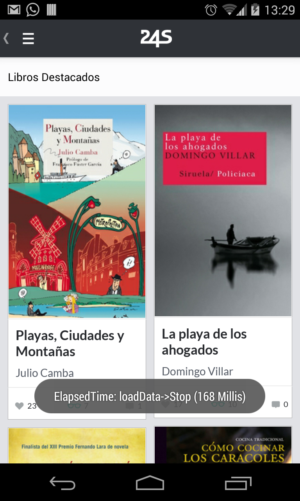

ElapsedTime
=============

This library is used by developers to know the time elapsed in your project (Functions, Databases, Constructors ...). 



Usage
-----

Start ElapsedTime at the beginning of your function and Stop at the end:


```java

		public void functionToTest {

        	ElapsedTime.getSharedInstance(context).start("funtionToTest");

			doSomething();
			
			ElapsedTime.getSharedInstance(context).stop("funtionToTest");

		}

```

Or customizing:

* Enable Log

```java

	ElapsedTime.getSharedInstance(context).setLogEnabled(false);
	
```

* Log type

```java

	ElapsedTime.getSharedInstance(context).setLogType(LOG_TYPE.DEBUG);
	
```

* Set time in millis (default seconds)

```java

	ElapsedTime.getSharedInstance(context).setMillis(true);
	
```

* start and stop showing toast

```java

		public void functionToTest {

        	ElapsedTime.getSharedInstance(context).start("funtionToTest", true);

			doSomething();
			
			ElapsedTime.getSharedInstance(context).stop("funtionToTest", true);

		}	
```

Credits & Contact
-----------------

ElapsedTime was created by jcmore2@gmail.com


License
-------

ElapsedTime is available under the Apache License, Version 2.0.
